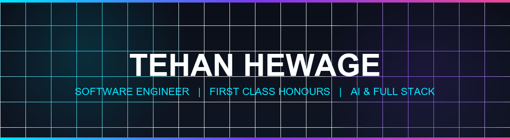

<!-- HERO BANNER -->

 

<!-- TYPING ANIMATION -->

  

<!-- SOCIAL CONNECT LINKS -->

---

## 👨‍💻 About Me

Software Engineering Graduate with First Class Honours from SLIIT City Uni.

**I build:**
- AI-powered applications
- Full-stack web platforms
- SaaS products
- Automation systems

**Currently exploring:**
- AI Agents
- MCP integrations
- Cloud architecture
- Software engineering best practices

---

## 💼 Experience

### Finance, Digital Marketing & IT Support Intern
*Routes to Ceylon (Pvt) Ltd* • `Jul 2025 - Oct 2025`

- Delivered IT support, network setup, and responsive technical troubleshooting to staff
- Managed digital operations, finance reporting, and daily operational workflows
- Designed creative marketing content and visual assets for digital campaigns
- Led contributions to business process improvements and Guest Envelope design project

---

## 🛠️ Tech Stack

### Frontend

  
  
  
  
  

### Backend

  
  
  
  

### Database

  
  
  

### AI

  
  
  

### Tools

  
  
  
  
  

---

## 🚀 Featured Projects

### 🤖 [Kavi AI](https://github.com/Tehan-Hewage/kavi)
AI shopping assistant integrated with Kapruka using Model Context Protocol (MCP).

- **Features:** AI shopping conversations, catalog product search, real-time delivery fee quotes & 60-min checkout link generation
- **Tech Stack:** `TypeScript` • `MCP Protocol` • `Node.js` • `AI Agent`

 

### 🎨 [GexaCanvas AI](https://github.com/Tehan-Hewage/GexaCanvas-AI)
Full-stack AI chat and image generation platform with dark glassmorphism UI.

- **Features:** Gemini AI chat with markdown rendering, text-to-image generation via Hugging Face, Supabase Auth session history
- **Tech Stack:** `React` • `Express` • `Supabase` • `Gemini AI` • `Hugging Face`

 

### 🌐 [LinkNook](https://linknook.online/)
SaaS mini-profile and Linktree-style page builder platform.

- **Features:** Live profile customization, button styling & wallpaper controls, user dashboard, Supabase backend architecture
- **Tech Stack:** `React` • `Next.js` • `Supabase` • `Tailwind CSS`

 

### 💬 WhatsApp Multi-Agent Bot
SLIIT City University AI student support assistant using multi-agent query routing.

- **Features:** Intent classification, multi-agent query routing (Finance, Academic, Student Affairs), WhatsApp Cloud API integration
- **Tech Stack:** `Node.js` • `Python` • `Firebase` • `WhatsApp Cloud API`

 

### 🧹 [CleanOPS](https://github.com/Tehan-Hewage/Clean_Ops)
Cleaning operations management system for HR teams, supervisors, and field staff.

- **Features:** Geofenced clock-in/out tracking, checklist execution, payroll reporting, offline-first PWA support
- **Tech Stack:** `Next.js` • `TypeScript` • `Firebase` • `PWA`

 

### 📊 [GSMArena Explorer](https://github.com/Tehan-Hewage/GSMArena-data-scrapper)
Device specs explorer and comparison web app powered by Cheerio web scraping.

- **Features:** Automated GSMArena spec scraping, in-memory TTL caching, device comparison & brand listings
- **Tech Stack:** `React` • `Node.js` • `Express` • `Cheerio`

---

## 📊 GitHub Analytics

  
  
    
  

---

## 🐍 Contribution Snake

  

---

## 🎯 Current Focus

**Building:**
- **Kavi AI**: Multilingual e-commerce shopping agent with MCP integration
- **LinkNook SaaS**: Production feature rollouts and custom subdomains
- **AI-powered systems**: Multi-agent routing and tool-use agents

**Learning:**
- Autonomous AI Agents & Tool-Use Protocols
- Cloud Systems Architecture & Serverless Design
- Automated Testing & CI/CD Pipelines

---

## 📬 Contact & Connect

**Open for:**
- Software Engineering opportunities
- AI & Full-Stack projects
- Freelance collaborations

 

Tehan Hewage • Software Engineering Graduate (First Class Honours) • SLIIT City Uni

